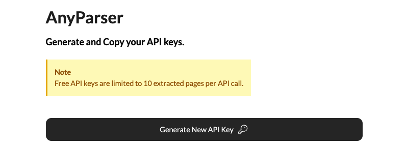

## Get started with AnyParser SDK
The quickest way to get started with `AnyParser` is using the SDK.

If you'd prefer to call the RESTful API directly, please refer to the [API Reference](/api-reference/)

The SDK has the following features:
- Full content parsing
- Key-value extraction

The rest of this guide will go through a full content parsing example. To see how to get started with the other features, please browse the rest of the [SDK reference](/sdk-reference/).

## Setup

First install [any-parser](https://pypi.org/project/any-parser/) from `pypi`.

```python
pip install any-parser
```

Next get your API key from the [CambioML website](https://www.cambioml.com/account).


Finally, set up your `AnyParser` sync or async client.

```python anyparser_sync.py
from any_parser import AnyParser

ap = AnyParser(api_key="...")

md_output, total_time = ap.extract(file_path="/path/to/your/file")
```

```python anyparser_async.py
from any_parser import AnyParser

ap = AnyParser(api_key="...")

file_id = ap.async_extract(file_path="/path/to/your/file")

md = ap.async_fetch(file_id=file_id)
```

## Full Examples

Check out these notebooks for more detailed examples of using AnyParser.

<CardGroup cols={2}>
  <Card
    title="AnyParser Sync Example"
    icon="bolt-lightning"
    href="https://github.com/CambioML/any-parser/blob/main/examples/pdf_to_markdown.ipynb"
  >
    Extracting content from a table of contents.
  </Card>
  <Card
    title="AnyParser Async Example"
    icon="rotate"
    href="https://github.com/CambioML/any-parser/blob/main/examples/async_pdf_to_markdown.ipynb"
  >
    Extracting content from a table of contents.
  </Card>
</CardGroup>

